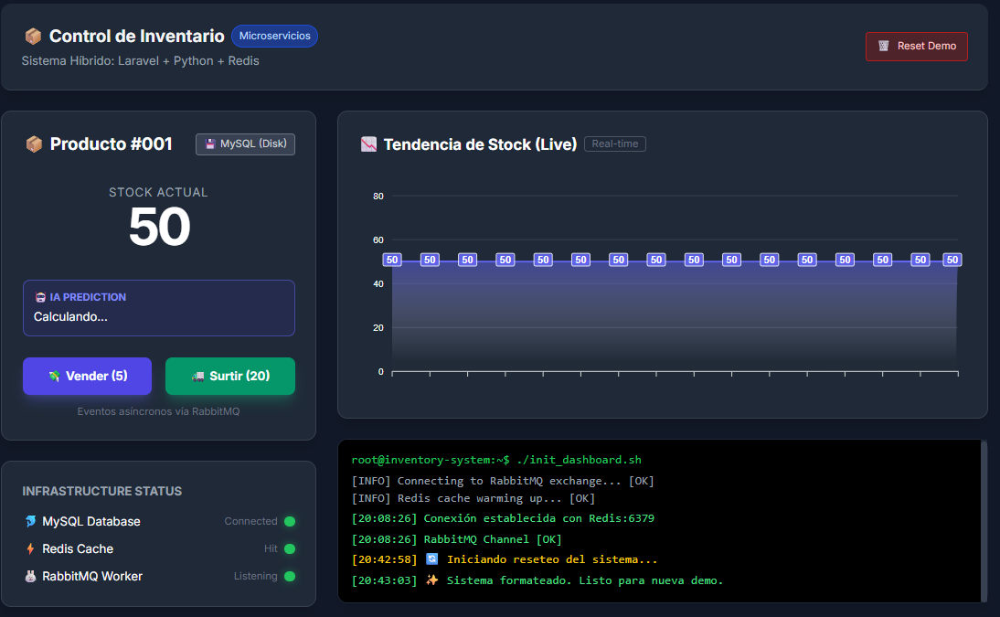

# 📦 Sistema de Inventario Inteligente con Microservicios

Sistema de gestión de inventario con predicción de stock mediante inteligencia artificial. Arquitectura basada en microservicios que utiliza Laravel (backend API), Python (AI Worker), RabbitMQ (mensajería), Redis (caché) y MySQL (base de datos).

## ✨ Características Principales

- 🔄 **Procesamiento asíncrono** de eventos mediante RabbitMQ
- 🤖 **Predicción de agotamiento de stock** mediante análisis de IA en tiempo real
- ⚡ **Caché en Redis** para acceso rápido a predicciones
- 📊 **API REST** completamente documentada con Scribe
- 🐳 **Dockerizado** para fácil despliegue y desarrollo
- 📈 **Análisis en tiempo real** de velocidad de ventas
- 🔍 **Monitoreo** de colas y eventos a través de RabbitMQ Management

## 🏗️ Arquitectura del Sistema

El sistema está compuesto por los siguientes microservicios:

```
┌─────────────┐      ┌──────────────┐      ┌─────────────┐
│   Cliente   │──────│  Laravel API │──────│   MySQL     │
│  (Frontend) │      │   (Backend)  │      │  (Base de   │
│             │      │              │      │   Datos)    │
└─────────────┘      └──────┬───────┘      └─────────────┘
                            │
                            │ Eventos
                            ▼
                    ┌──────────────┐
                    │   RabbitMQ   │
                    │  (Mensajería)│
                    └──────┬───────┘
                           │
                           │ Consumo
                           ▼
                    ┌──────────────┐      ┌─────────────┐
                    │  AI Worker   │◄─────│    Redis    │
                    │   (Python)   │      │   (Caché)   │
                    └──────────────┘      └─────────────┘
```

### Componentes

- **Backend (Laravel)**: API REST principal que gestiona ventas, productos y stock
- **AI Worker (Python)**: Procesa eventos de ventas desde RabbitMQ y calcula predicciones de agotamiento de stock
- **RabbitMQ**: Sistema de mensajería asíncrona para eventos de ventas y reabastecimiento
- **Redis**: Caché en memoria para predicciones de IA (TTL: 24 horas)
- **MySQL**: Base de datos persistente para productos, ventas y predicciones

### Flujo de Trabajo

1. Se registra una venta mediante `POST /api/sales`
2. El stock se actualiza en MySQL
3. Se envía un evento a RabbitMQ
4. El AI Worker procesa el evento y calcula cuándo se agotará el stock
5. La predicción se almacena en MySQL y Redis para acceso rápido

## 🛠️ Stack Tecnológico

### Backend
- **Laravel 12.x** - Framework PHP
- **PHP 8.2** - Lenguaje de programación
- **Scribe** - Generador de documentación API

### AI Worker
- **Python 3.9** - Lenguaje de programación
- **Pandas** - Análisis de datos
- **SQLAlchemy** - ORM para MySQL
- **Pika** - Cliente RabbitMQ
- **Redis** - Cliente Python para Redis

### Infraestructura
- **Docker & Docker Compose** - Contenedores
- **MySQL 8.0** - Base de datos
- **Redis Alpine** - Caché en memoria
- **RabbitMQ 3 Management** - Mensajería

## 🚀 Instalación y Despliegue

### Requisitos Previos

- Docker >= 20.10
- Docker Compose >= 2.0
- Git
- Puertos libres: 8000, 3306, 6379, 5672, 15672

### Pasos de Instalación

1. **Clonar el repositorio**
```bash
git clone <repository-url>
cd inventory-microservices
```

2. **Iniciar los servicios con Docker Compose**
```bash
docker-compose up -d --build
```

3. **Ejecutar migraciones de base de datos**
```bash
docker exec -it inventory_backend php artisan migrate
```

4. **Crear un producto de prueba (opcional)**
```bash
docker exec -it inventory_db mysql -u root -prootpassword inventory_db -e "
INSERT INTO products (name, price, stock, created_at, updated_at) 
VALUES ('Producto Demo', 25.00, 50, NOW(), NOW());
"
```

### Acceso a los Servicios

Una vez iniciados los servicios, puedes acceder a:

- **API Backend**: http://localhost:8000
- **Documentación API**: http://localhost:8000/docs
- **RabbitMQ Management**: http://localhost:15672 (usuario: `guest`, contraseña: `guest`)
- **MySQL**: localhost:3306 (usuario: `root`, contraseña: `rootpassword`)
- **Redis**: localhost:6379

## 🎮 Guía de Uso (Demo)

### 1. Registrar una Venta

```bash
curl -X POST http://localhost:8000/api/sales \
  -H "Content-Type: application/json" \
  -d '{"product_id": 1, "quantity": 5}'
```

### 2. Consultar Información del Producto

```bash
curl http://localhost:8000/api/products/1
```

La respuesta incluirá la predicción de agotamiento de stock calculada por el AI Worker:

```json
{
  "product": "Producto Demo",
  "price": "25.00",
  "stock": 45,
  "ai_prediction": "Se agota en 13.5 días",
  "source": "Redis (RAM)"
}
```

### 3. Reabastecer Stock

```bash
curl -X POST http://localhost:8000/api/products/1/restock \
  -H "Content-Type: application/json" \
  -d '{"quantity": 20}'
```

### 4. Reiniciar Simulación (Solo para demos)

```bash
curl -X POST http://localhost:8000/api/reset
```

⚠️ **Nota**: Este endpoint elimina todas las ventas y restablece el stock. Solo para desarrollo/demos.

## 📚 Documentación de API

La API está completamente documentada usando [Scribe](https://scribe.knuckles.wtf/), que genera documentación interactiva automáticamente desde las anotaciones en el código.

### Acceder a la Documentación

Una vez que el proyecto esté en ejecución, puedes acceder a:

- **Documentación HTML Interactiva**: http://localhost:8000/docs
- **Colección de Postman**: http://localhost:8000/docs.postman
- **Especificación OpenAPI**: http://localhost:8000/docs.openapi

### Regenerar Documentación

Si realizas cambios en los controladores o rutas, regenera la documentación ejecutando:

```bash
docker exec -it inventory_backend php artisan scribe:generate
```

La documentación incluye ejemplos de código en múltiples lenguajes (bash, JavaScript, PHP, Python) y permite probar los endpoints directamente desde el navegador.

## 📊 Dashboard



*Captura del dashboard mostrando el estado del inventario y las predicciones de IA*

## 👤 Autor

**Jhon Emmir**

### 🔗 Contacto

- **GitHub**: [jhonemmir](https://github.com/jhonemmir?tab=repositories)
- **LinkedIn**: [emmir](https://www.linkedin.com/in/emmir)

---

⭐ Si te gusta este proyecto, ¡dale una estrella!
